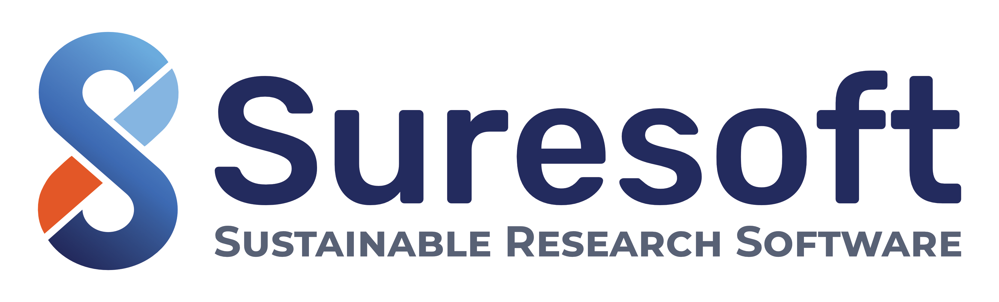

## Braunschweiger RSE Community
Welcome! We are Research Software Engineers from Braunschweig. You are welcome to get in touch with us.  We would be happy to receive questions, discussions and, of course, participation.

## SURESOFT

{:width="300px"}

Suresoft is a DFG funded project at TU Braunschweig fostering the sustainability of research software by helping researchers adopt practices and tools from the software engineering community. 
We offer:
- workshops about research software engineering practices
- in person code reviews
- discussions and more ...

 

## Get in Touch

**Mailingliste**: [https://lists.tu-braunschweig.de/sympa/info/musen-rse](https://lists.tu-braunschweig.de/sympa/info/musen-rse) 

**Kontakt**
  - [Jan Linxweiler](mailto:j.linxweiler@tu-braunschweig.de)
  - [Sven Marcus](mailto:s.marcus@tu-braunschweig.de)
  - [Sören Peters](mailto:soe.peters@tu-braunschweig.de)

## MISC
- [GitLab](https://git.rz.tu-bs.de/suresoft)
- [Zenodo Suresoft Community](https://zenodo.org/communities/suresoft/)