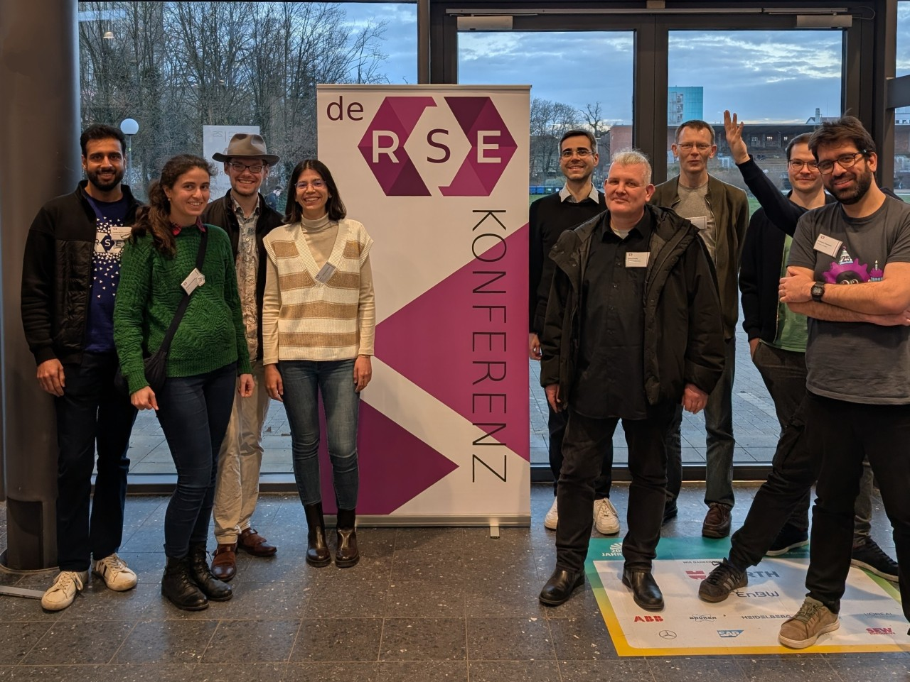
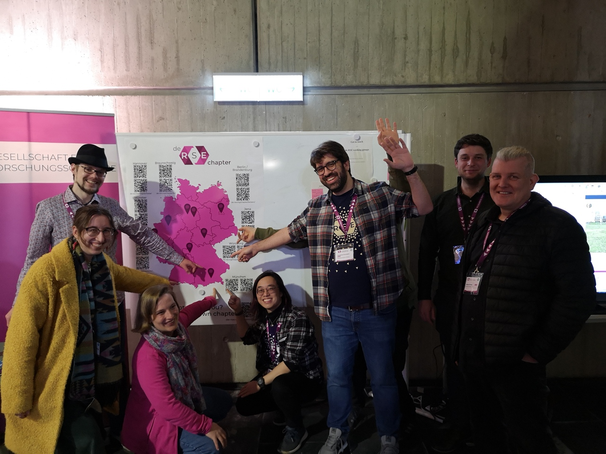

_**Better Software - Better Research, also in Munich!**_

Our group is the place to meet other [research software engineers](https://de-rse.org/en/) in Munich. Do you write code for research? It doesn't matter if you just started or you are already an expert - This is your crowd!

We aim for a meeting every two months, followed by dinner and networking.
Our meetings include short talks about anything related to RSE (research data management, software development, teaching/training, and more), as well as open discussions on topics brought into the agenda by any attendee.

_A part of our group (with unfortunately many people missing) met at [deRSE25](https://events.hifis.net/event/2050/)._

## Join the group

Get the latest updates and say hi in our:

- [Matrix channel](https://matrix.to/#/#derse-chapter-muc:gitter.im)
- [Mailing list](https://lists.lrz.de/mailman/listinfo/rse)

## News

Next event: **Thursday, March 19**, 18:00 – 19:30, at the LMU University Library ([Register here](https://pad.okfn.de/p/rse-muc-meetup2-26)):

- Introductions and general announcements
- Open round: RSE Journal Club (see pad for details)
- Closing remarks and planning next meetings

Afterwards: Stammtisch-style discussions at [Atzinger](https://atzinger-restaurant.de/).

Save the date also for the next sessions in 2026:

- May 6, 18:00 - 19:30
- July 30, 18:00 - 19:30
- September 24, 18:00 - 19:30
- November 26, 18:00 - 19:30

By default at the LMU University Library, unless announced otherwise. Speak up if you are interested in hosting!

## Past activity

- 2026-01-29: First meeting in 2026, at the LMU University Library - [Meeting notes](https://pad.okfn.de/p/rse-muc-meetup1-26)
  - Results from the survey and discussion about the future of the group 
- 2025-10-16: Fifth meeting in 2025, at the LMU University Library - [Meeting notes](https://pad.okfn.de/p/rse-muc-meetup5-25)
  - Talk: Experiences of a researcher, who went from "works in my computer" to leading an open-source research suite Enhance.pet
  - Discussion: FutuRSI survey and research software services in Munich
- 2025-07-03: Fourth meeting in 2025, at the Max Planck Computing and Data Facility - [Meeting notes](https://pad.okfn.de/p/rse-muc-meetup4-25)
  -  Talk by Raphael Ritz (MPCDF): Data rescue operations in Germany and beyond
  -  Talk by Michele Martone (LRZ): Insights and reflections after three weeks of scientific computing conferences
- 2025-05-22: Third meeting in 2025, at the LMU Hospital - [Meeting notes](https://pad.okfn.de/p/rse-muc-meetup3-25)
  - Talk by Alberto Villagran (cBRAIN lab, KJP, LMU University Hospital): Experience in the implementation of Open Science principles in KUM-LMU cBRAIN lab (neuroimaging lab) (under the LMU OSC program "Switch to Open")
  - Talk by Balthasar Schachtner (LMU Hospital): CORE, a scientific computing infrastructure at the LMU hospital 
- 2025-03-20: Second meeting in 2025, at LMU - [Meeting notes](https://pad.okfn.de/p/rse-muc-meetup2-25)
  - Talk by Jonas Hagenberg (MP Psychiatry): Summary of the "Code for Science oder: Bessere Forschungssoftware durch bessere Forschungssoftwarekompetenzen" workshop from December 2024
  - Talk by David Walter and Laura Bahamón (MPDL): Presentation of our project "MAUS" - Machine Automated Support for Software Management Plans
- 2025-01-23: First meeting in 2025, at MPDL - [Meeting notes](https://pad.okfn.de/p/rse-muc-meetup5-24)
  - Talk by Raphael Ritz (MPCDF): The EOSC EU Node
  - Talk by Gerasimos Chourdakis (Univ. Stuttgart / TUM): Standardization process and metadata in the preCICE ecosystem
- 2024-10-17: Fourth meeting in 2024, at LMU - [Meeting notes](https://pad.okfn.de/p/rse-muc-meetup4-24)
  - Talk by Nafiseh Moti (LRZ): HPC I/O tracing, new patterns and challenges 
  - Talk by Michele Martone (LRZ): Lessons learned from organizing a Free Software Appreciation Day or Afternoon
- 2024-06-20: Third meeting in 2024, at LRZ - [Meeting notes](https://pad.okfn.de/p/rse-muc-meetup3-24)
  - Talk by Ivan Pribec (LRZ): Introducing the Fortran-Lang community
  - Talk by Friedrich Ulrich and Benjamin Farnbacher (TUM): Research Data Management in HPMC: Applications & Best Practices
- 2024-04-11: Second meeting in 2024, at LMU - [Meeting notes](https://pad.okfn.de/p/rse-muc-meetup2-24)
  - Talk by Dominik Leipold (LMU): Digital Infrastructure and RSE for the Critical Edition of the Works of Richard Strauss
  - Talk by Jonas Hagenberg (MPI of Psychiatry): The code club at the MPI  of Psychiatry
- 2024-02-22: First meeting in 2024, at the Max Planck Digital Library - [Meeting notes](https://pad.okfn.de/p/rse-muc-meetup1-24)
  - Talk by Benjamin Rodenberg (TUM): CodeOcean, Binder and Reproducible Python
  - Talk by Björn Brötz (DLR): An open-source electronic laboratory notebook
- 2023-12-14: Fourth meeting in 2023, at LMU - [Meeting notes](https://pad.okfn.de/p/rse-muc-meetup4-23)
   - Talk by Hendrik Ballhausen: Privacy Preserving Computation – how to collaborate without sharing data
   - Talk by Michele Martone: The FIM (Fbi IMproved) image viewer and its development
- 2023-10-12: Third meeting in 2023, at LMU - [Meeting notes](https://pad.okfn.de/p/rse-muc-meetup3-23)
   - Talk by Raphael Ritz: NFDI Jupyter Hub
   - Talk by Michele Martone: Brief Basic Introduction in Semantic Patching with Coccinelle
- 2023-06-29: Second meeting in 2023, at LMU - [Meeting notes](https://pad.okfn.de/p/rse-mus-meetup2-23)
  - Open discussion about [DataCite](https://datacite.org/) and ways to cite software, the [NFDI](https://www.nfdi.de/) initiative and the RSE working group, the [de-RSE Unconference](https://un-derse23.sciencesconf.org/), and the [Digital Research Academy](https://heidiseibold.ck.page/posts/feedback-wanted-building-a-digital-research-academy).
- 2023-03-15: First meeting in 2023, at LMU - [Meeting notes](https://pad.okfn.de/p/rse-muc-meetup1-23)
  - Talk by Michael Franke: Software Management Plans
  - Talk by Gerasimos Chourdakis: [Continuous Integration with GitHub Actions in preCICE](http://go.tum.de/389945)
- 2019-03-11: First attempt for a regular meeting / Stammtisch at a restaurant (continued for 1-2 more evenings)
- 2019-02-26: First [Blog post](https://www.de-rse.org/blog/2019/02/26/neue-rse-gruppen-in-m%C3%BCnchen-und-m%C3%BCnster.html) about our group, following a meeting at LRZ

## Contact

We organize ourselves mainly over the [Mailing list](https://lists.lrz.de/mailman/listinfo/rse) and a [Matrix channel](https://matrix.to/#/#derse-chapter-muc:gitter.im). Definitely join us there to learn about upcoming events and other activities.

For questions regarding the group, feel free to contact, for example:
  - [Larissa Leiminger](https://www.mpdl.mpg.de/en/about-us/team.html) - MPDL
  - [Martin Spenger](https://www.ub.uni-muenchen.de/ueber-die-ub/kontakt/personen/spenger/index.html) - LMU
  - [Gerasimos Chourdakis](https://www.cs.cit.tum.de/en/sccs/people/gerasimos-chourdakis/) - Univ. Stuttgart / TUM

**Sprache:** Um die Reichweite der Gruppe zu maximieren und mit Rücksicht auf die vielen nicht-deutschen Studenten, Doktoranden und Forscher in München, ist die Arbeitssprache der Gruppe Englisch. Natürlich bleibt Deutsch immer eine Option für die Diskussionen.

## Further photos

_A part of our group (with unfortunately many people missing) met at [deRSE24](https://events.hifis.net/event/994/). Photoshooting arranged by Maximilian Frank._

[Edit this page](https://github.com/DE-RSE/chapter/blob/master/_pages/muc/index.md)
